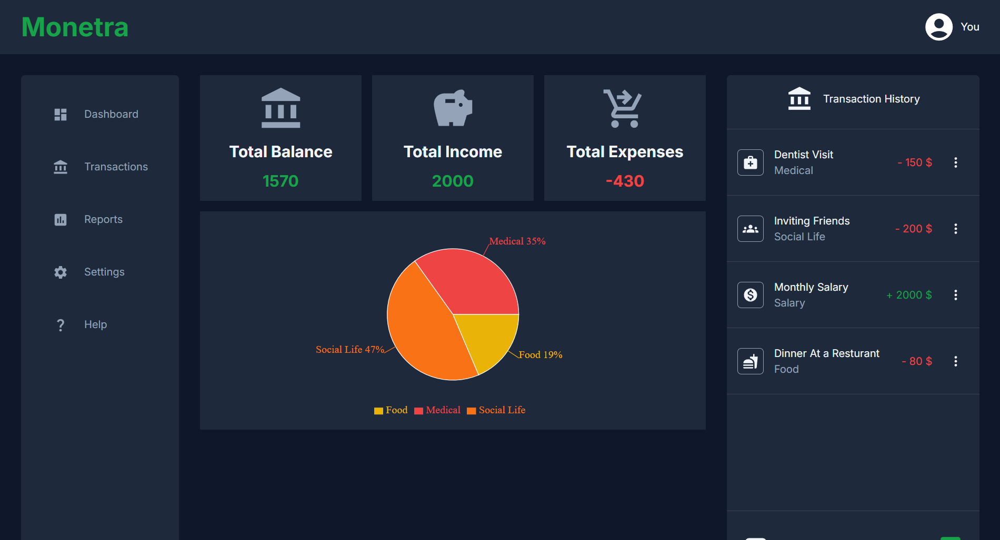
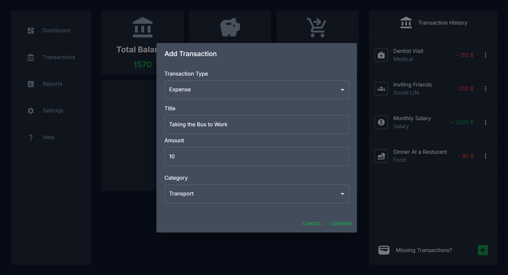

# Monetra

Monetra is a **responsive React tracking dashboard** that helps users manage income, expenses, and categories with real-time statistics and persistent local storage.

---

## 🌐 Live Demo
🔗 [Monetra on Vercel](https://monetra-iota.vercel.app/)

---

## ✨ Features

### 💰 Transaction Managment
- Add income and expense transactions
- Categorize transactions dynamically based on type
- Edit and remove existing transactions

### 📊 Financial Dashboard
- Real-time balance calculation
- Income vs expense tracking
- Category-based statistics

### 📂 Smart  UI Behavior
- Dynamic category filtering based on transaction type
- Form validation with disabled submit for invalid inputs
- Scrollable transaction list with fixed dashboard layout

### ⚡ UX Improvements
- Responsive dashboard layout
- Clean Material UI design
- Smooth state updates across components

### 💾 Data Persistence
- Transactions stored localStorage for persistence across sessions

## ⚒️ Tech Stack

**Frontend**
- React
- TypeScript
- Context API
- Material-UI

**Storage**
- localStorage

**Deployment**
- Vercel

## 🚀 Installation

- Clone the repo: `git clone https://github.com/abdullah-zeinalabdin/monetra.git`
- Navigate into the project folder: `cd monetra`
- Install dependencies: `npm install`
- Start app locally: `npm start`
- Open [http://localhost:3000](http://localhost:3000) in your browser to see the app

## 📸 Screenshots

### 🏠 Dashboard Page

### 🔎 Add/Edit Transaction

## 🔮 Future Improvments
- Add charts for category breakdown (Recharts)
- Monthly filtering (Date-based analytics)
- Routing with multiple pages (React-Router)
- Export data (CSV)

## 📄 License & Attribution

- This project is licensed under **MIT**.
